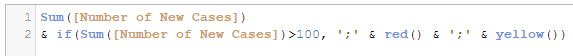
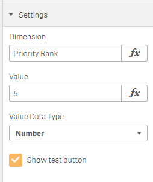
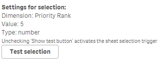

# irregular-widgets

A Qlik Sense widget library for version 3.1 and later.

Also a little playground to break the limitations of Qlik Sense Widgets by using Angular expressions.

## Installation

**Qlik Sense Desktop**

Extract file [bi-irregular-widgets.zip](bi-irregular-widgets.zip) to the extension folder: 

```
C:\Users\<username>\Documents\Qlik\Sense\Extensions
```

**Qlik Sense Server**

Open Qlik Sense QMC on [https://yourserver/qmc](https://yourserver/qmc) and import file [bi-irregular-widgets.zip](bi-irregular-widgets.zip) as extension.

# Widgets

## Dynamic Label Table

A simple table widget (it renders a HTML table and should used for small amounts of data only) providing 20 expression settings for dynamic column labels (headers). You can use any Qlik expression like aggregations and variables. If no expression is set for a label the default label text will be used instead.

For multiple line labels use Qlik function chr(10) as new line: ='Some text' & chr(10) & 'new line..'


**Settings**


Please notice that settings "max. Columns" and "Rows per page" effect the underlaying HyperCube and take place if the Mashup is reloaded (F5).

**Dynamic Coloring**

Extend the measure string with a semicolon + font-color + semicolon + background color:

Use CSS color names:


Use Qlik color functions:



If you want to sort by a measure with color coding you need to wrap it into a Dual() function.

**Display Images**

You can encode an image URL and CSS style in the fields data to display images in cells

Syntax of expression:

1. image:
2. URL
3. ;
4. {CSS style JSON}


Example:

```
image:/content/default/logos/logo1.jpg;{'height':10}
```


**Column Sorting**

Column sorting can be changed by click on field label. This works for dimensions and measures.

## Sheet Selection Trigger

A widget to define a selection for one dimension and a value (expression can be used here) to process this selection on a sheet when sheet is opened.



For design time it displays the parameters (also the result of a value expression) and a test button. After successful testing you switch off the display and selection is processed automatically if the sheet is opened where you placed this widget.



## Author

**Ralf Becher**

+ [irregular.bi](http://irregular.bi)
* [twitter/irregularbi](http://twitter.com/irregularbi)
* [github.com/ralfbecher](http://github.com/ralfbecher)

## License

Copyright © 2016 Ralf Becher

Released under the MIT license.

***