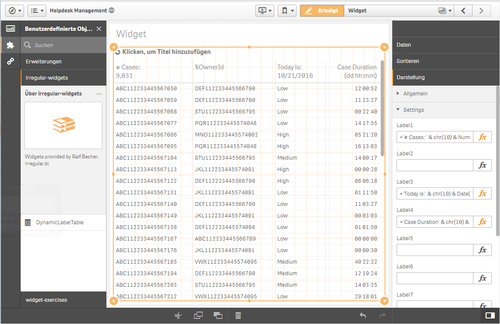
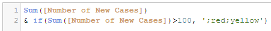

# irregular-widgets

A Qlik Sense widget library for version 3.1 and later.

## Installation

**Qlik Sense Desktop**

Extract file [bi-irregular-widgets.zip](bi-irregular-widgets.zip) to the extension folder: 

```
C:\Users\<username>\Documents\Qlik\Sense\Extensions
```

**Qlik Sense Server**

Open Qlik Sense QMC on [https://yourserver/qmc](https://yourserver/qmc) and import file [bi-irregular-widgets.zip](bi-irregular-widgets.zip) as extension.

## Widgets

### DynamicLabelTable

A simple table widget providing 20 expression settings for dynamic column labels (headers). You can use any Qlik expression like aggregations and variables. If no expression is set for a label the default label text will be used instead.

For multiple lines use Qlik function chr(10) as new line: ='Some text' & chr(10) & 'new line..'



**Dynamic Coloring**

Extend the measure string with a semicolon + font-color + semicolon + background color:

Use CSS color names:



Use Qlik color functions:


## Author

**Ralf Becher**

+ [irregular.bi](http://irregular.bi)
* [twitter/irregularbi](http://twitter.com/irregularbi)
* [github.com/ralfbecher](http://github.com/ralfbecher)

## License

Copyright © 2016 Ralf Becher

Released under the MIT license.

***